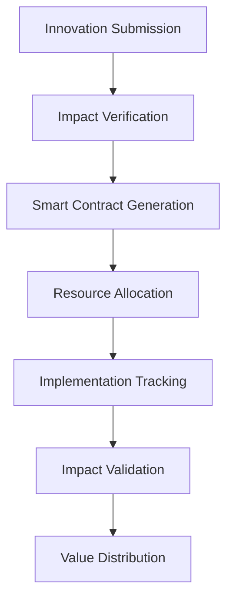

# OpenInnovate Platform
[](https://opensource.org/licenses/MIT)
[](https://openinnovate.org)
[](https://openinnovate.org)

OpenInnovate is a blockchain-based platform designed to accelerate humanitarian innovation through decentralized markets. By combining impact verification, token economics, and smart contracts, we're building a framework to bridge the gap between life-saving innovations and real-world implementation.

## Market Overview
(Source: WHO Global Status Report 2022, NHTSA)

- Global Car Seat Market: $6.5B (2023)
- Annual US Child Fatalities: 1,050
- Preventable Incidents: 58%
- Average Safety Product Cost: $932

## Platform Design Goals

- **Impact Verification System**
  - Multi-layer validation
  - Real-time tracking
  - Community oversight
  - Transparent metrics

- **Token Economics Framework**
  - Resource optimization
  - Implementation incentives
  - Market alignment
  - Value distribution

- **Smart Contract Architecture**
  - Rights management
  - Resource allocation
  - Quality assurance
  - Automated validation

## Development Status

| Component | Status | Timeline |
|-----------|---------|----------|
| Core Protocol | In Development | Q1 2024 |
| Smart Contracts | Design Phase | Q2 2024 |
| Verification System | Planning | Q3 2024 |
| Token Economics | Research | Q4 2024 |

## Reference Implementation

[Project Guardian](https://github.com/hocmemini/Project--Guardian) demonstrates our platform's potential through child safety innovation:

- Addressable Market: $6.5B globally
- Target Implementation: 24 months
- Initial Markets: US, EU, China
- Regulatory Framework: In development

## System Architecture



## Development Objectives

- **Protocol Development**: Open-source, community-driven
- **Verification System**: Multi-layer validation
- **Resource Management**: Automated allocation
- **Impact Tracking**: Real-time monitoring

## Repository Structure

```
OpenInnovate/
├── core/                  # Core platform infrastructure
├── contracts/            # Smart contract templates
├── verification/         # Impact verification system
├── tokenomics/          # Economic model design
├── implementation/      # Reference frameworks
└── docs/               # Documentation
```

## Getting Started

1. **Explore the Platform**
   ```bash
   git clone https://github.com/hocmemini/OpenInnovate.git
   cd OpenInnovate
   ```

2. **Review Documentation**
   - [Platform Overview](docs/OVERVIEW.md)
   - [Technical Design](docs/TECHNICAL.md)
   - [Implementation Framework](docs/IMPLEMENTATION.md)

## Contributing

OpenInnovate is an open-source initiative focused on humanitarian innovation. We welcome contributions in:

- Protocol development
- Implementation frameworks
- Documentation
- Use case development
- Impact verification

See our [Contributing Guide](CONTRIBUTING.md) for details.

## Technical Requirements

- Node.js 18+
- Ethereum development tools
- IPFS compatibility
- Web3 libraries

## License

This project is released under the MIT License. See [LICENSE](LICENSE) for details.

## Contact

- Website: [openinnovate.org](https://openinnovate.org)
- Email: collaborate@openinnovate.org
- GitHub Discussions: [OpenInnovate Discussions](https://github.com/hocmemini/OpenInnovate/discussions)

## Impact Focus

OpenInnovate is designed to:
- Accelerate innovation deployment
- Verify real-world impact
- Enable global collaboration
- Scale proven solutions

Join us in revolutionizing how life-saving innovations reach implementation.

---

<sub>Every 16 seconds, somewhere in the world, a parent loses a child in a preventable accident. The technology to change this exists today. What we lack isn't innovation – it's implementation.</sub>
