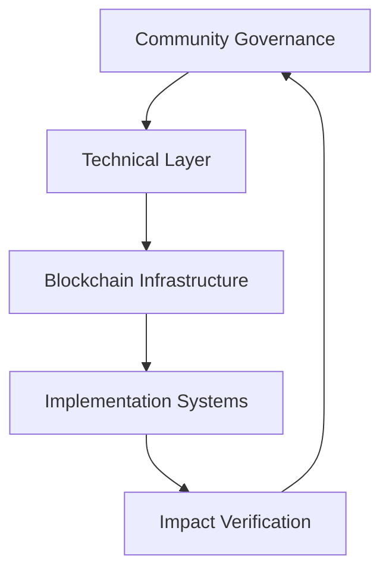
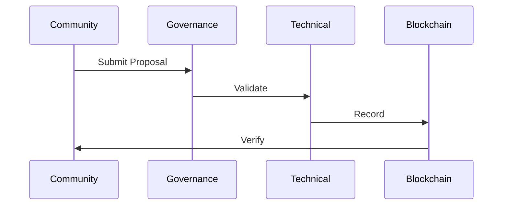
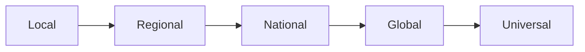

# OpenInnovate: Governance & Technical Architecture
[/platform/governance-architecture.md]

## System Overview


## 1. Governance Framework

### Decision Making Flow
```python
def governance_process(proposal):
    if proposal.impact_score > THRESHOLD:
        initiate_community_review()
        if technical_validation():
            proceed_to_voting()
            if community_approval():
                implement_changes()
```

### Voting Structure

#### Weight Distribution
| Stakeholder | Base Weight | Impact Multiplier |
|-------------|-------------|-------------------|
| Technical Contributors | 30% | x1.5 per verified contribution |
| Manufacturers | 25% | x1.2 per implementation |
| Community Members | 25% | x1.1 per validated input |
| Impact Verifiers | 20% | x1.3 per verified assessment |

#### Proposal Requirements
```javascript
const proposalCriteria = {
    technicalDoc: 'Complete documentation',
    impactAnalysis: 'Verified metrics',
    resourceAssessment: 'Detailed breakdown',
    implementationPlan: 'Clear pathway',
    communityBenefit: 'Measurable value'
};
```

## 2. Technical Architecture

### Core Components
```
Platform Architecture:
├── Governance Layer
│   ├── Voting System
│   ├── Proposal Management
│   └── Impact Verification
├── Technical Layer
│   ├── Project Management
│   ├── Resource Allocation
│   └── Implementation Tracking
└── Blockchain Layer
    ├── Smart Contracts
    ├── Data Verification
    └── Value Distribution
```

### Smart Contract Structure
```solidity
contract OpenInnovate {
    struct Project {
        uint256 id;
        address creator;
        uint256 impactScore;
        mapping(address => bool) stakeholders;
        Phase currentPhase;
    }

    struct Governance {
        mapping(uint256 => Proposal) proposals;
        mapping(address => uint256) votingPower;
        uint256 proposalThreshold;
    }

    // Implementation functions
    function submitProposal() external {}
    function vote() external {}
    function implementDecision() external {}
}
```

## 3. System Integration

### Data Flow


### Access Control
```python
def access_management():
    roles = {
        'admin': ['system_updates', 'emergency_actions'],
        'validator': ['technical_review', 'impact_assessment'],
        'contributor': ['proposal_submit', 'vote'],
        'viewer': ['read_access']
    }
    return verify_permissions(user, action)
```

## 4. Implementation Controls

### Project Management
```javascript
const projectStages = {
    validation: {
        technical: 'Expert review',
        impact: 'Community assessment',
        resource: 'Capability check'
    },
    implementation: {
        development: 'Tracked progress',
        deployment: 'Staged rollout',
        verification: 'Impact confirmation'
    }
};
```

### Resource Allocation
| Resource Type | Assignment Method | Verification |
|---------------|------------------|--------------|
| Technical | Capability Matching | Peer Review |
| Manufacturing | Capacity Verification | Output QA |
| Distribution | Network Analysis | Coverage Check |

## 5. Value Distribution

### Token Mechanics
```solidity
contract ValueDistribution {
    struct Reward {
        uint256 contribution;
        uint256 impact;
        uint256 timelock;
    }
    
    mapping(address => Reward) public rewards;
    
    function distributeValue(
        address contributor,
        uint256 amount
    ) external {
        // Value distribution logic
    }
}
```

### Incentive Structure
- Technical Contributions: Impact-weighted rewards
- Implementation Success: Market-based incentives
- Community Support: Participation rewards
- Verification Activities: Accuracy-based compensation

## 6. Security Framework

### Protection Layers
```python
def security_protocol():
    return {
        'access': 'Multi-factor authentication',
        'transactions': 'Multi-sig requirements',
        'data': 'Encrypted storage',
        'execution': 'Verified computation',
        'recovery': 'System redundancy'
    }
```

### Audit Requirements
- Quarterly Code Reviews
- Monthly Security Scans
- Continuous Monitoring
- Incident Response Protocol
- Recovery Procedures

## 7. Scaling Strategy

### Growth Management


### Performance Metrics
| Level | Users | Projects | Implementations |
|-------|-------|----------|-----------------|
| Alpha | <1000 | <10 | 1-2 |
| Beta | <10000 | <50 | 5-10 |
| Release | >10000 | >100 | >20 |
