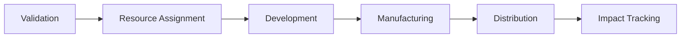
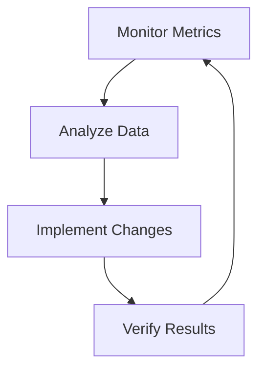

# Implementation Framework
[/platform/implementation.md]

## Quick Reference


## 1. Resource Assignment

### Required Confirmations
- [ ] Technical team identified
- [ ] Manufacturing partner secured
- [ ] Distribution channels confirmed
- [ ] Market access established
- [ ] Support infrastructure ready

### Success Metrics
```python
def resource_readiness():
    return {
        'technical_capacity': '100% staffed',
        'manufacturing_capability': '> 85% verified',
        'distribution_network': '> 90% coverage',
        'support_systems': 'fully operational'
    }
```

## 2. Development Path

### Phase Structure
```
Development Timeline:
├── Alpha (4-6 weeks)
│   ├── Core functionality
│   ├── Safety validation
│   └── Initial testing
├── Beta (6-8 weeks)
│   ├── Feature completion
│   ├── Performance optimization
│   └── Certification prep
└── Release (4 weeks)
    ├── Final validation
    ├── Production setup
    └── Launch preparation
```

### Critical Checkpoints
| Milestone | Criteria | Timeline |
|-----------|----------|----------|
| Alpha Complete | Core Function | Week 6 |
| Beta Launch | Feature Set | Week 14 |
| Release Ready | Full Validation | Week 18 |

## 3. Manufacturing Integration

### Setup Requirements
```javascript
const manufacturingChecklist = {
    facilityPrep: 'Tooling & Equipment',
    qualitySystem: 'ISO 9001 Compliance',
    staffTraining: 'Product Specific',
    supplyChain: 'Verified Sources',
    monitoring: 'Real-time Systems'
};
```

### Production Ramp
1. Pilot Run
   - 100 units
   - Full QA review
   - Process validation

2. Initial Production
   - 1,000 units
   - Market seeding
   - Distribution test

3. Full Scale
   - Market-driven volume
   - Optimized efficiency
   - Continuous improvement

## 4. Market Entry

### Launch Sequence
```sql
SELECT launch_requirements WHERE
    market_readiness = VERIFIED AND
    distribution_active = TRUE AND
    support_systems = OPERATIONAL AND
    monitoring = ACTIVE
```

### Distribution Strategy
- Primary Markets: Direct channels
- Secondary Markets: Partner network
- Support Infrastructure: Regional hubs
- Feedback Systems: Real-time monitoring
- Adjustment Protocol: Data-driven

## 5. Impact Tracking

### Metric Collection
```python
def track_impact():
    monitor_lives_affected()
    measure_problem_resolution()
    verify_resource_efficiency()
    validate_market_success()
    assess_community_benefit()
```

### Performance Dashboard
- Lives Impacted: Real-time counter
- Resource Efficiency: % vs target
- Market Performance: Sales/Distribution
- User Feedback: Satisfaction metrics
- Community Impact: Benefit assessment

## Optimization Protocol

### Continuous Improvement
Monitor → Analyze → Adjust → Verify


### Adjustment Triggers
| Metric | Target | Action Threshold |
|--------|--------|------------------|
| Impact | +/-10% | Review & Adjust |
| Resources | +/-15% | Optimize Flow |
| Market | +/-20% | Strategy Review |

## Support Systems

### Technical Assistance
```javascript
const supportLevels = {
    tier1: 'Community Support',
    tier2: 'Technical Expert',
    tier3: 'Core Development',
    emergency: '24/7 Response'
};
```

### Resource Access
- Documentation Hub
- Expert Network
- Tool Repository
- Training Materials
- Support Channels

## Implementation Tools

### Development Resources
```bash
project-tools/
├── templates/
├── guides/
├── scripts/
├── testing/
└── monitoring/
```

### Quality Assurance
- Automated Testing
- Manual Reviews
- Performance Monitoring
- User Feedback
- Impact Verification

---

Implementation Support:
- Chat: [Community Forum](https://github.com/hocmemini/OpenInnovate/discussions)
- Email: collaborate@openinnovate.org
- Docs: [Implementation Guide](docs/implementation-guide.md)
- Tools: [Resource Repository](tools/)
