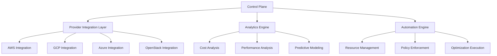

# Comprehensive Cloud Infrastructure Management System Analysis

## 1. Technical Specifications

### Core System Requirements
- Compute: High-performance processing units for real-time analysis
- Memory: 32GB+ per management node
- Network: < 10ms latency between components
- Storage: Multi-tier with hot/warm/cold data management

### Integration Points
1. Cloud Providers
```yaml
Required APIs:
- AWS: Organizations, CloudWatch, Cost Explorer
- GCP: Cloud Billing, Monitoring, Resource Manager
- Azure: Cost Management, Monitor, Resource Manager
- OpenStack: Telemetry, Nova, Swift
```

2. Performance Requirements
```
Metric          | Target    | Minimum
-----------------------------------
Response Time   | 100ms     | 250ms
Throughput      | 1000 r/s  | 500 r/s
Availability    | 99.99%    | 99.95%
Data Latency    | 50ms      | 100ms
```

## 2. Business Metrics Framework

### Key Performance Indicators (KPIs)

1. Cost Optimization
```
Metric                  | Target
------------------------------------
Cost Reduction         | 25-30%
Resource Utilization   | >85%
Waste Elimination      | >90%
ROI Period            | <6 months
```

2. Operational Efficiency
```
Metric                  | Target
------------------------------------
Automation Rate        | >95%
Manual Interventions   | <5/week
System Uptime         | 99.99%
Issue Resolution Time | <30 mins
```

3. Customer Success
```
Metric                  | Target
------------------------------------
Implementation Time    | <2 weeks
Customer Satisfaction | >90%
Feature Adoption      | >80%
Churn Rate           | <5%
```

## 3. Implementation Roadmap

### Phase 1: Foundation (Months 1-3)
- Core infrastructure setup
- Basic monitoring implementation
- Initial provider integrations
- MVP dashboard development

### Phase 2: Intelligence (Months 4-6)
- Optimization algorithms
- Machine learning models
- Predictive analytics
- Cost optimization engine

### Phase 3: Automation (Months 7-9)
- Automated resource management
- Self-healing capabilities
- Policy enforcement
- Compliance automation

### Phase 4: Scale (Months 10-12)
- Enterprise features
- Advanced analytics
- Multi-region support
- High availability setup

## 4. System Architecture



## 5. Security Framework (Additional Consideration)

### Security Layers
1. Infrastructure Security
- Zero-trust architecture
- Multi-factor authentication
- Encryption at rest and in transit
- Regular security audits

2. Operational Security
```yaml
Requirements:
- SOC 2 Type II compliance
- GDPR compliance
- ISO 27001 certification
- Regular penetration testing
```

3. Data Security
```python
class DataSecurityFramework:
    def __init__(self):
        self.encryption = AES256Encryption()
        self.access_control = RBACController()
        self.audit_logger = SecurityAuditLogger()
```

## 6. Scalability Design (Additional Consideration)

### Horizontal Scaling
1. Component Scaling
```
Component          | Scale Unit  | Max Scale
-----------------------------------------
Control Plane     | 1000 nodes  | 100k nodes
Analytics Engine  | 500 req/s   | 50k req/s
Provider APIs     | 200 req/s   | 20k req/s
```

2. Data Scaling
```python
class ScalabilityManager:
    def __init__(self):
        self.shard_manager = DatabaseSharding()
        self.cache_system = DistributedCache()
        self.load_balancer = AdaptiveLoadBalancer()
```

Supporting Code Example for Control System:

```python
class CloudControlSystem:
    def __init__(self):
        self.security = SecurityFramework()
        self.scaling = ScalabilityManager()
        self.metrics = MetricsCollector()
        
    async def manage_infrastructure(self):
        # Collect current state
        metrics = await self.metrics.gather()
        security_status = await self.security.audit()
        
        # Analyze and optimize
        optimization_plan = await self.generate_plan(
            metrics,
            security_status
        )
        
        # Execute with safety checks
        if self.validate_plan(optimization_plan):
            await self.execute_plan(optimization_plan)
            await self.verify_execution()
```

Critical Success Factors:
1. Technical Excellence
- Robust architecture
- Reliable automation
- Scalable design

2. Business Execution
- Market timing
- Enterprise adoption
- Customer success

3. Security & Compliance
- Zero-trust implementation
- Continuous compliance
- Regular auditing
